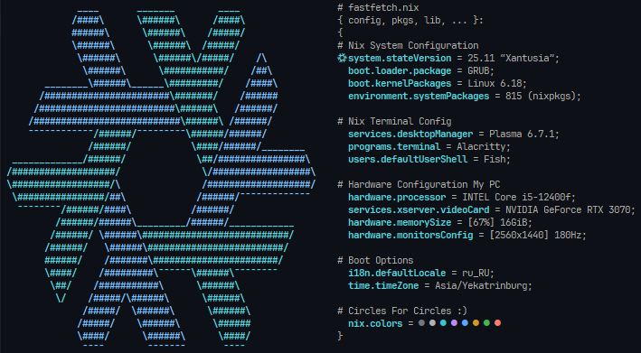

# My NixOS-like custom fastfetch
I had nothing better to do, so I decided to create a custom `fastfetch` in the <u>NixOS style</u>. I also added this fetch to my main [NixOS configuration](https://github.com/krevetka-ural/my-nixos-configuration.git) via `home-manager`.

